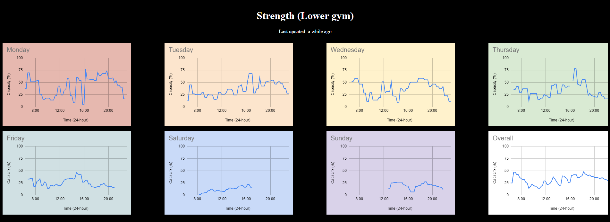

<h2>UWW Gym Statistics</h2>

  
👩‍💻  My Experience: 4+ years of coding

🏢  Title: Backend Developer

🧠  Currently Learning: React

✉️  Reach Me: [blankenheimlevi@gmail.com](mailto:blankenheimlevi@gmail.com)

🕸   Website: [leviblankenheim.com](https://www.leviblankenheim.com)

🌍  Location: Based in Madison, WI

This was a small project I worked on. I was fed up trying to find the best times to go to the gym at my university, so I made my own stat tracker.

<h3>Preview of site:</h3>

